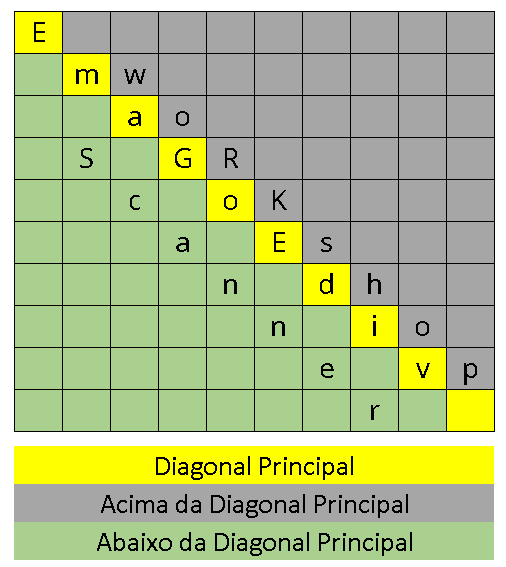

## Desafio - Caça Palavras
Exercício 3166 do URI Online Judge

Linguagem: Python\
Ferramentas: Git/GitHub, Confluence e Jira\
Única regra: não utilizar bibliotecas que não são nativas.

### Enunciado

Em Algelandia, o passatempo preferido são os jogos de Caça Palavras. Um destes tem as seguintes características:

* As palavras ocorrem apenas no sentido da diagonal principal;
* As palavras podem ocorrer com letras maiúsculas e/ou minúsculas;
* Se uma dada palavra existe, ela ocorre uma única vez e em qualquer posição da diagonal;
* As palavras podem existir tanto na forma normal quanto invertida, ou seja, a leitura da diagonal pode ocorrer na forma top-down ou bottom-up.

Neste contexto, a figura abaixo demonstra como as palavras “workshop”, “videogame” e “scanner” podem ocorrer no jogo.



### Entrada

A primeira linha contém três inteiros: 1) N que representa a quantidade palavras que iremos verificar se existem no jogo, limitado por [1,100]; 2) M que representa a quantidade de linhas da matriz, limitado por [10,1000]; 3) P que representa a quantidade de colunas da matriz, limitado por [10,1000]. Além disso, cada palavra N segue o limite: [6,100].

### Saída

Conforme a existência de cada palavra N, informe:

* 1 Palavra "X" na diagonal principal
* 2 Palavra "X" acima da diagonal principal
* 3 Palavra "X" abaixo da diagonal principal
* 4 Palavra "X" inexistente

Onde X é a palavra procurada.

### Entregáveis

* Um programa que recebe uma lista com palavras e uma matriz com o quadro e retorna uma dicionário com as palavras como chave e as respostas como valores inteiros. O programa deve validar os argumentos recebidos.
* Um programa para testar a função construída utilizando datasets da pasta "data".
* Um programa que gera casos de teste.

Tarefa | Arquivo | Membro
--------- | ------ | ------
Desenvolver a função de validação | /solution/auxiliary_functions | Pedro
Desenvolver funções auxiliares | /solution/auxiliary_functions | Paulo
Desenvolver a função desafio | /solution/challenge.py | Fábio
Desenvolver o programa de teste | test.py | Miquelutti
Criar N casos de teste | create_data.py | Bárbara
Gerenciar o repositório (revisar commits e PRs) | ------ | Gustavo

Linguagem: Python

Única regra: não utilizar bibliotecas que não são nativas.

### Arquivos no repositório

```bash
│   create_data.py
│   matrix.png
│   README.md
│   test.py
│   
├───solution
|       auxiliary_functions.py
|       __init__.py
|
└───data
        input_1.txt
        output_1.txt
        .
        .
        .
        input_N.txt
        output_N.txt
```

### Git

Caso ainda **não tenha usado o Git nenhuma vez**, a página [Git](https://geofisica-uff.atlassian.net/wiki/spaces/HA/pages/978550785/Git) do Confluence é um bom começo.

Assumindo que você já possui o Git baixado, instalado e configurado. Siga os passos:
```bash
git init                        # iniciando repositório
git remote add origin <link>    # conectando com o github
git checkout -b seuNome         # criando uma branch com o seu nome
git pull origin main            # baixando tudo da branch master/main do GitHub
```

Depois que você escrever o seu código:
```bash
git add.                        # adicionando todas mudanças na pasta
git commit -m "HACKAGEO-X #done"   # commitando
git push origin seuNome         # enviando a sua branch para o GitHub
```

Sempre que quiser baixar a versão mais recente:
```bash
git pull origin main            # pode surgir conflitos, confirme tudo que não haverá problema
                                # pois a branch master/main é a mais atualizada e segura
```

Resumindo: Faça download (pull) direto da master/main e faça upload (push) direto para a sua branch pessoal. O Gustavo revisará as chegadas (pull request) e unirá na main (merge).
